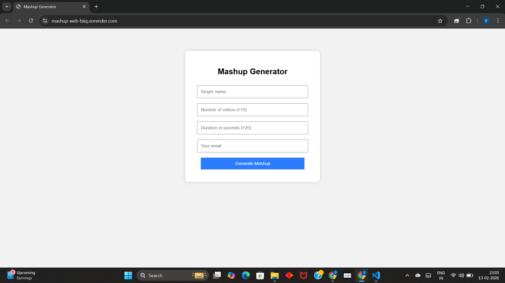

# 🎵 YouTube Mashup Generator 🎧✨

_This project is submitted as part of_ **Assignment – Mashup**  
for the course **UCS654**.

_Submitted by:_  
**Dhruv Kamboj (102303645)**  
**Group:** 3C45  

---

## 🎯 Objective

The objective of this project is to design and implement a **YouTube Mashup Generator** that automatically collects songs of a selected singer, processes the audio, and generates a combined mashup file.

The system is implemented in two parts:

- A **command-line program** for mashup generation
- A **web-based service** that allows users to generate mashups and receive them via email

The key goals of this project are:

- To automate downloading and processing audio from YouTube
- To demonstrate multimedia processing using Python libraries
- To build a simple web-based mashup generator
- To deploy the application on a cloud platform

---

## 🧩 Problem Description

Creating mashups manually requires:

- Searching for multiple songs
- Downloading each video
- Extracting audio
- Trimming clips
- Merging them into a final track

This process is repetitive and time-consuming.

The proposed system automates the entire workflow using Python, allowing a user to generate a mashup with just a few inputs.

---

## ⚙️ System Overview

The mashup generator performs the following steps:

1. Download **N videos** of a given singer from YouTube
2. Convert each video into an audio file
3. Trim the first **Y seconds** from each audio
4. Merge all trimmed clips into a single mashup file
5. Send the mashup to the user via email (web version)

---

## 🧪 Program 1 – Command Line Mashup

A Python script that accepts input parameters and generates a mashup locally.

### Command Format
```bash
python <rollnumber>.py <SingerName> <NumberOfVideos> <AudioDuration> <OutputFileName>
```
---

## 🌐 Program 2 – Web-Based Mashup Service

A **Flask-based web application** that allows users to generate mashups through a simple interface.

### User Inputs

- Singer name
- Number of videos
- Duration of each clip
- Email address

### Output

- Mashup generated automatically
- Sent as a **ZIP file via email**

---

## 🔗 Live Web Application

**Deployed on Render:**  
https://mashup-web-biiq.onrender.com

### ⚠️ Note on Free Render Hosting

This application is hosted on the **free tier of Render**.

- The service goes to sleep after inactivity.
- The first request may take **30–60 seconds** to load.
- After waking up, the app works normally.

---

## 🖥 Web Interface Screenshot



---

## 🛠 Technologies Used

### Backend
- Python
- Flask

### Media Processing
- yt-dlp (YouTube video downloading)
- moviepy (video-to-audio conversion)
- pydub (audio trimming and merging)
- FFmpeg (audio/video processing engine)

### Deployment
- Render (cloud hosting platform)

---

## 📂 Project Structure


